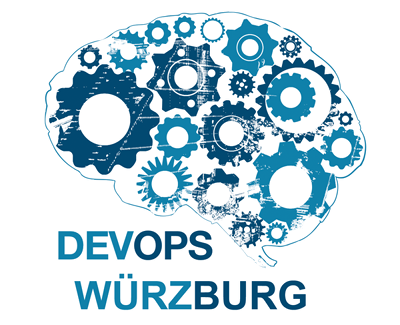
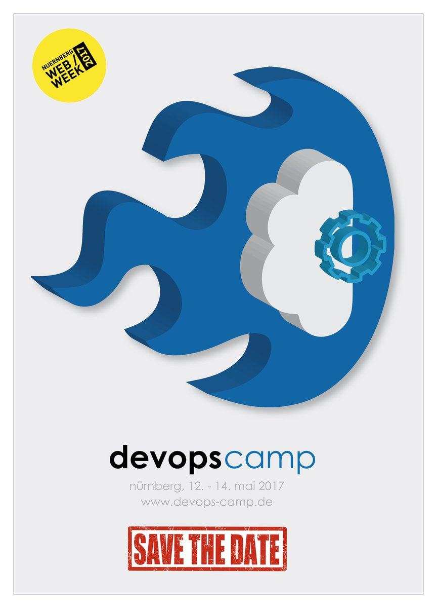
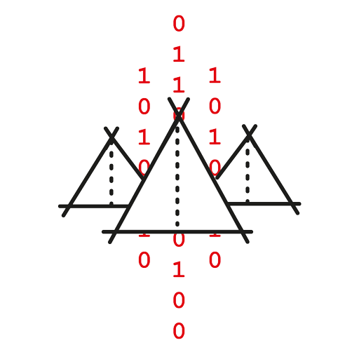

class: center, middle, inverse

# Willkommen

## zum sechsten
#- Happy .easter-egg-r[E].easter-egg-b[a].easter-egg-y[s].easter-egg-r[t].easter-egg-g[e].easter-egg-v[r] -
## DevOps-Meetup

## #DevOpsWue

---

# Programm

- Thema - Automation mit Github, Slack, Travis CI und AWS

- Pause

- Nachgang ;-) 

- Was immer ihr wollt..

---
# Organisatoren

- Sebastian Kremer, EIKONA Systems GmbH, Volkach

- Steffen Gebert, Würzburg

- Andreas Rudat, Mayflower GmbH, Würzburg

---
# Danke!

- Für euer Mitwirken :)

- Mayflower für die Location und Getränke

.center[]

---
# Bitte!

- Auf _meetup.com_ bewerten und kommentieren!

- Macht Werbung
  - Xing Event
  - Twitter #DevOpsWue
  - Facebook
  - Mund-zu-Mund Propaganda

- Wünsche und Vorschläge zu Themen, Vorträgen etc.

- Fragt mal euren Chef wegen Sponsoring :-)

---
#Upcommings

.center[https://devops-camp.de]
.center[]
.center[https://developercamp.io]
.center[]
