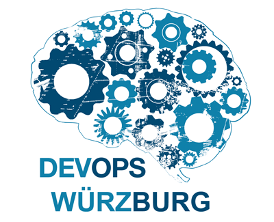
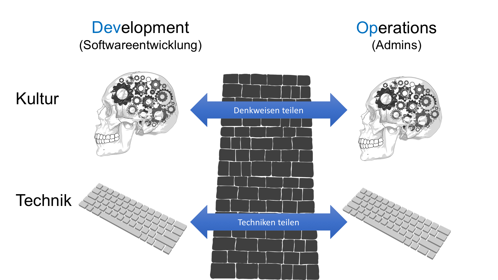
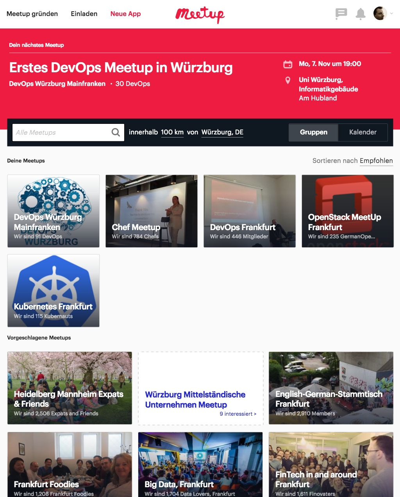
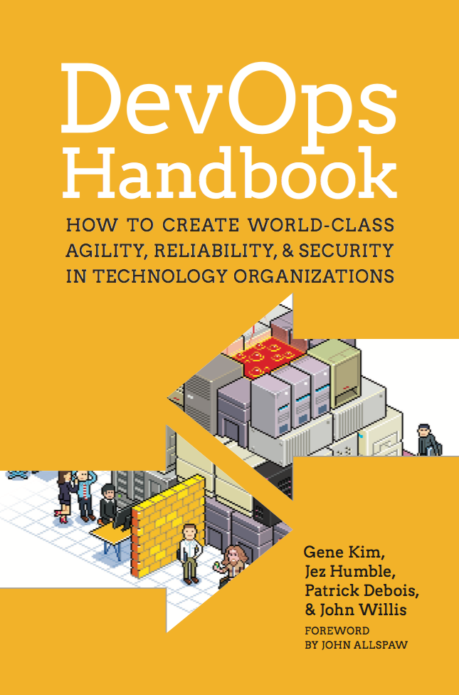

class: center, middle, inverse

# Willkommen

## zum ersten DevOps-Meetup

---

# Programm

- Was ist ein Meetup und was stellen wir uns vor?

- Was stellt ihr euch vor?

- Vortrag 1 (ca. 20min)

- Pause

- Vortrag 2 (ca. 20min)

- Diskussion & weitere Planung

---

# WLAN

schaffen wir ohne. Können reden.

# Handys

bitte lautlos

---
class: center, middle

Hallo

# du!

???

Wir wollen und können alle voneinander lernen, von daher ega, ob wir Student, Geschäftsführer oder Professor sind..

---

# Bitte Aktiv werden

???

Jeder soll / darf mitdiskutieren. Keine Vorlesung

---
# Organisatoren

- Steffen Gebert, Universität Würzburg

- Andreas Rudat, Mayflower GmbH, Würzburg

- Sebastian Kremer, Eikona AG, Volkach

- TODO: Hashtags überlegen

---
# Wieso wollen wir Meetups?

- Erfahrung- und Wissensaustausch

- Weiterbildung

- Von einander lernen

- Vernetzung untereinander

- Nachwuchs fördern

---
# Wieso wollen wir _dieses_ Meetup?

- Gemeinsames Interesse am (breiten) Themenfeld "DevOps"

---
# Wieso wollen wir _dieses_ Meetup?

- Gemeinsames Interesse am (breiten) Themenfeld "DevOps"

  - Heute vorwiegend kulturelle Aspekte
  - Später Fokus auf technische Aspekte

- Abgrenzung (andere Meetups):

  - Kultur: _Agile Usergroup Unterfranken_
  - Webentwicklung/JavaScript: _Front End Würzburg_

- Themenauswahl: Bevorzugt durch _uns alle_!

  - Auf Kärtchen ein oder mehrere Themen schreiben
  - Versuchen Vorträge danach zu richten
  - Du kannst was erzählen? Sprich uns an!

???

Evtl Überschrift nicht ganz passend. "Unsere Vorüberlegungen"

---
# Meetup.com

.left-column[
- Bitte in Meetup-Gruppe eintragen!

- Folien
 
- Themensammlung

- Anlaufstelle für weitere Informationen

- Ankündigung weiterer Treffen

]
.right-column[]

???

Außerdem sieht es für Ausenstehende gut ansprechender aus, wenn 

Ggf. weitere spannende Meetups entdecken.

---
# Weiteres Vorgehen

- Rhythmus
  - Alle 4/6/8 Wochen?
  - Fixe Wochentage?

- Programmvarianten
  - Vortrag & Diskussion (1 langer oder 2/3 kurze Vorträge bevorzugt?)
  - Open Space

- Locations
  - hier
  - Mayflower (Frauenland)
  - Eikona (Volkach)
  - ??
  
- In Meetup bewerten und kommentieren!

---
class: center, middle
# Vorstellungsrunde

3 Hashtags zu persönlichen Interessen

---
# Vortrag 1

## DevOps - neue Antworten auf neue Herausforderungen

Lenz Weber, mayflower

---
class: center, middle, inverted

# Pause

sponsored by Mayflower

---
# Vortrag 2

## Continuous Delivery - Software schneller entwickeln und ans Ziel bringen

Steffen Gebert, Uni Würzburg

---
class: center, middle
# Feedbackrunde & Diskussion

---
# Nächste Meetup(s)

- Brainstorming: Git, Docker, Jenkins, Chef, Puppet, AWS, zsh, ELK, solr, whateverJS, Kubernets, Mesos, 

- Jemand konkreten Themenvorschlag?

- Sebastian Klenk, Technology Evangelist bei Microsoft

---
# Buchverlosung

---

# .center[Danke!]

.center[]

- Für euer Interesse und Erscheinen :)

- Mayflower für das Sponsoring der Pizza und Getränke

